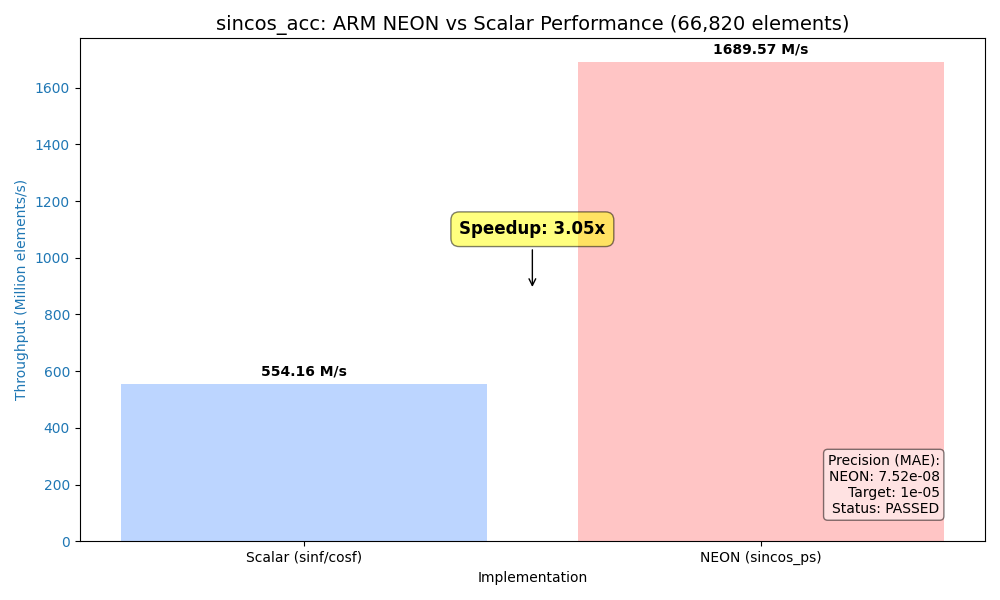

# sincos_acc

**ARM NEON SIMD-Optimized Sine and Cosine Library for Embedded Systems.**

`sincos_acc` is a high-performance C library designed to accelerate trigonometric calculations on ARM NEON architectures. It provides a vectorized implementation of sine and cosine functions that process 4 elements simultaneously in a single operation, achieving significant speedups over standard C library implementations while maintaining high precision.



## Key Features

*   **SIMD Acceleration**: Leverages ARM NEON intrinsics to process 4 single-precision floats at once.
*   **High Performance**: Achieved **3.05x speedup** compared to standard `sinf`/`cosf` (tested on ARM64).
*   **Exceptional Precision**: Max Absolute Error (MAE) of **7.52e-08** (passing the 1e-05 target).
*   **Cache-Aware Processing**: Optimized for both small (65x65) and large (260x257) grids.
*   **Simple API**: One function call handles arbitrary element counts with automatic vectorization and remainder handling.

## Performance & Accuracy

Tested with a grid of 66,820 elements (approx. 260x257) across a range of $-2\pi$ to $2\pi$.

| Implementation | Execution Time | Throughput | Precision (MAE) |
| :--- | :--- | :--- | :--- |
| **Scalar (`sinf`/`cosf`)** | 0.000121 s | 554.16 M/s | Reference |
| **NEON (`sincos_ps`)** | **0.000040 s** | **1689.57 M/s** | **7.52e-08** |

**Speedup Ratio: 3.05x**

## Getting Started

### Prerequisites
*   An ARM compiler (e.g., `gcc` or `clang`) with NEON support.

### Building & Running Benchmarks

1.  **Clone the repository**:
    ```bash
    git clone https://github.com/huntkao/sincos_acc.git
    cd sincos_acc
    ```

2.  **Compile the benchmark**:
    ```bash
    make
    ```

3.  **Run the analysis**:
    ```bash
    ./perf_test
    ```

## Project Structure
- `include/sincos_neon.h`: Public API definition.
- `src/sincos_neon.c`: Core implementation logic.
- `extern/neon_mathfun.h`: SIMD math engine (optimized minimax polynomial).
- `benchmarks/perf_test.c`: Comprehensive analysis and verification suite.

## Acknowledgements
The core SIMD engine uses an optimized port of `neon_mathfun.h`, originally by Julien Pommier.

## License
Distributed under the zlib license. See `extern/neon_mathfun.h` for copyright details.
